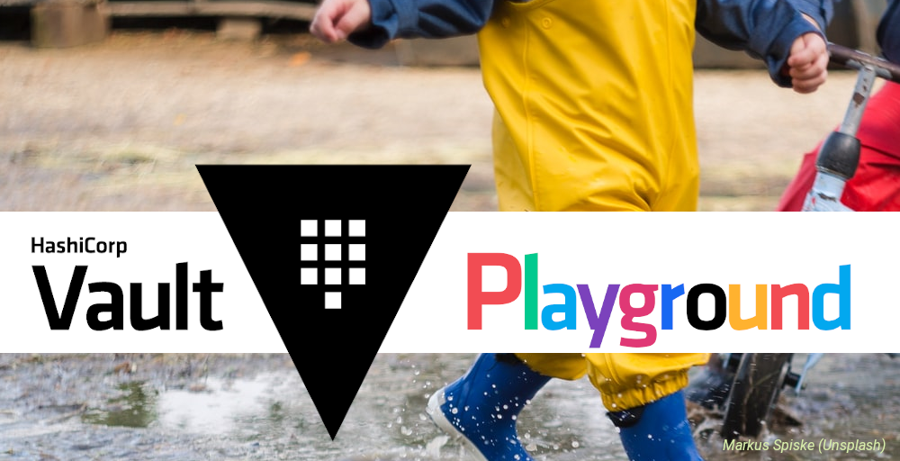

# Vault Identity and Group Management Playground

This repository provides a playground and some Terraform bootstrap code to experiment and explore identity and group management with HashiCorp Vault.



The repository currently focuses on integration with the following authentication methods and external systems:
- AppRole
- OpenID Connect (OIDC, Keycloak container)
- LDAP (FreeIPA container)
- Kubernetes API (K3s container)
- GitHub Workflows

## Prerequisites

Install `docker-compose`, `kubectl` and `helm` on your local machine.

Use v1 cgroups or the v1 compatibility mode on v2 systems for the FreeIPA container to work correctly, see:
* https://www.redhat.com/sysadmin/fedora-31-control-group-v2
* https://github.com/freeipa/freeipa-container/issues/429

To enable v1 compatibility set the kernel parameter:
```
systemd.unified_cgroup_hierarchy=0
```

## Usage Instructions and FAQ

See [./USAGE.md](./USAGE.md)

## Code of Conduct

This repository has a [code of conduct](CODE_OF_CONDUCT.md), we will
remove things that do not respect it.

## About this repository

As a company, we shape a world of innovative, sustainable and resilient IT solutions
built on trustworthy open source technology to unlock the full potential of our customers.

This repository contains part of the action behind this commitment. Feel free to
[contact](https://adfinis.com/en/contact/?pk_campaign=github&pk_kwd=vault)
us if you have any questions.

## License

This application is free software: you can redistribute it and/or modify it under the terms
of the [GNU General Public License](./LICENSE) as published by the Free Software Foundation,
version 3 of the License.

## Links

* [Vault Concepts > Identity](https://www.vaultproject.io/docs/concepts/identity)
* [Vault Identity Secrets Engine](https://www.vaultproject.io/docs/secrets/identity)
* [Vault Identity Secrets Engine API Docs](https://www.vaultproject.io/api-docs/secret/identity)
* [Vault Concepts > Client Count](https://www.vaultproject.io/docs/concepts/client-count)
