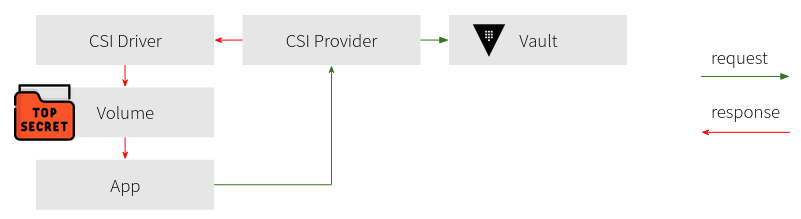

# Usage Instructions

**This is a development environment and should not be used in production!**

## 1. Vault Enterprise License
Retrieve a [Vault Enterprise trial license](https://www.hashicorp.com/products/vault/trial).

## 2. Setup environment
Export environment variables in a shell for

* the Vault license
  ```vash
  export VAULT_LICENSE=02MV4UU..
  ```
* the runtime you're going to use
  ```bash
  export CONTAINER_RUNTIME=${CONTAINER_RUNTIME:-docker}
  ```
  *The default is `docker`. If podman is going to be used, change this to `podman`.*
* the internal domain containers can be addressed with
  ```bash
  if [[ -z ${CONTAINER_RUNTIME##docker} ]];then export CONTAINER_DOMAIN=docker.internal; else export CONTAINER_DOMAIN=dns.podman; fi
  ```
  *uses `docker.internal` if docker is going to be used and `dns.podman` if podman. This does not need modification unless another domain name is required.*
* the realm domain for the freeipa server
  ```bash
  export IPA_REALM=${CONTAINER_DOMAIN^^}
  ```

Or create a `.env` file for `(docker|podman)-compose`
```bash
# Example for podman
CONTAINER_RUNTIME=podman
VAULT_LICENSE=02MV4UU..
echo CONTAINER_RUNTIME=${CONTAINER_RUNTIME:-docker} > .env
if [[ ${CONTAINER_RUNTIME} == "docker" ]]
then
  echo CONTAINER_DOMAIN=docker.internal
else
  echo CONTAINER_DOMAIN=dns.podman
fi >> .env
echo VAULT_LICENSE=${VAULT_LICENSE} >> .env
echo IPA_REALM=${CONTAINER_DOMAIN^^} >> .env
```

## 3. Start Containers

Start FreeIPA, Keycloak, Vault and K3s:
```bash
sudo 01-start.sh
```

## 4. Setup Resolution of Domain Names

You can either add a static record for every container to your `/etc/hosts` file or configure systemd-resolved service with `resolvectl` to use the container environment internal DNS (recommended).

### Option 1: Configuration using container internal dns (recommended)
First, find out which interface is used
```bash
if [[ ${CONTAINER_RUNTIME} == "docker" ]]
then
  CONTAINER_NETWORK_ID=$(sudo ${CONTAINER_RUNTIME} network inspect vault-playground_vault-playground | jq -j '.[].Id')
  CONTAINER_RUNTIME_IF=br-${CONTAINER_NETWORK_ID::12}
else
  CONTAINER_RUNTIME_IF=$(sudo ${CONTAINER_RUNTIME} network inspect vault-playground_vault-playground | jq -j '.[].network_interface')
fi
```
which IP it has assigned
```bash
CONTAINER_RUNTIME_IF_IP=$(ip -j -p -br -4 addr show dev ${CONTAINER_RUNTIME_IF} | jq -j '.[].addr_info | .[].local')
```
and then configure this interface to resolve the domain specified
```bash
sudo -E resolvectl dns ${CONTAINER_RUNTIME_IF} ${CONTAINER_RUNTIME_IF_IP}
sudo -E resolvectl domain ${CONTAINER_RUNTIME_IF} ${CONTAINER_DOMAIN}
```

On systems with NetworkManager (no `systemd-networkd`/`systemd-resolved`) use:
```bash
nmcli c mod ${CONTAINER_RUNTIME_IF} ipv4.dns ${CONTAINER_RUNTIME_IF_IP}
nmcli c mod ${CONTAINER_RUNTIME_IF} ipv4.dns-search ${CONTAINER_DOMAIN}
```

### Option 2: Static configuration using hosts file
Add a static A record for the container hosting FreeIPA, Keycloak and Vault. Alternatively, adjust your `/etc/hosts` file accordingly:

```bash
echo -e $(sudo -E ${CONTAINER_RUNTIME} inspect -f "{{range .NetworkSettings.Networks}}{{.IPAddress}} ipa.${CONTAINER_DOMAIN}{{end}}" ipa) | sudo tee -a /etc/hosts
echo -e $(sudo -E ${CONTAINER_RUNTIME} inspect -f "{{range .NetworkSettings.Networks}}{{.IPAddress}} keycloak.${CONTAINER_DOMAIN}{{end}}" keycloak) | sudo tee -a /etc/hosts
echo -e $(sudo -E ${CONTAINER_RUNTIME} inspect -f "{{range .NetworkSettings.Networks}}{{.IPAddress}} vault.${CONTAINER_DOMAIN}{{end}}" vault) | sudo tee -a /etc/hosts
echo -e $(sudo -E ${CONTAINER_RUNTIME} inspect -f "{{range .NetworkSettings.Networks}}{{.IPAddress}} k3s-server.${CONTAINER_DOMAIN}{{end}}" k3s-server) | sudo tee -a /etc/hosts
echo -e $(sudo -E ${CONTAINER_RUNTIME} inspect -f "{{range .NetworkSettings.Networks}}{{.IPAddress}} grafana.${CONTAINER_DOMAIN}{{end}}" grafana) | sudo tee -a /etc/hosts
echo -e $(sudo -E ${CONTAINER_RUNTIME} inspect -f "{{range .NetworkSettings.Networks}}{{.IPAddress}} prometheus.${CONTAINER_DOMAIN}{{end}}" prometheus) | sudo tee -a /etc/hosts
```

You need to clean up your `/etc/hosts` after successive runs to remove conflicting entries from previous runs.

## 5. Provision Test Identity/Group Data

This step provisions some identity and group test data, including:

| System | User/Group name | Password | Groups |
|---|---|---|---|
| FreeIPA | `test` | `test` | `testgroup` |
| FreeIPA | `kv-writer` | `kv-writer` | n/a |
| FreeIPA | `testgroup` | n/a | n/a |
| Vault | `testgroup-internal` (inside tenant) | n/a | n/a |
| Vault | `ldap-testgroup-external` | n/a | n/a |
| Vault | `oidc-testgroup-external` | n/a | n/a |
| Vault | `kv-writer` Entity | n/a | `kv-rw` |
| Vault | `kv-writer` Entity Alias for LDAP | n/a | n/a |
| Vault | `approle-kv` Group (Root NS and inside tenant) | n/a | n/a |
| Vault | `approle-kv` Entity | n/a | `approle-kv` |
| Vault | Entity Alias (UID) for `approle-kv` Entity | n/a | n/a |
| K3s | Application `ServiceAccount` `vault-kv` | n/a | n/a |
| K3s | Token Reviewer `ServiceAccount` `vault-csi-provider` | n/a | n/a |
| Vault | Entity Alias (UID) for `vault-kv` Entity | n/a | `kubernetes-kv` |
| Vault | `kubernetes-kv` Group (Root NS and inside tenant) | n/a | n/a |

Booting the [server components](#5-Access-the-Playground) might take a while. Verify that all server components are started before bootstrapping:
```bash
sudo ${CONTAINER_RUNTIME}-compose logs -f ipa
sudo ${CONTAINER_RUNTIME}-compose logs -f keycloak
sudo ${CONTAINER_RUNTIME}-compose logs -f vault
sudo ${CONTAINER_RUNTIME}-compose logs -f k3s-server
```

Initialize Vault:
```bash
sudo ${CONTAINER_RUNTIME} exec -it vault vault operator init -key-shares=1 -key-threshold=1 -format=json > vault-keys.json
```

Update `docker-compose` file with Vault root token:
```bash
token=$(cat vault-keys.json | jq -r ".root_token")
export VAULT_TOKEN=$token

sed -i 's/VAULT_TOKEN=.*$/VAULT_TOKEN='"$token"'/g' docker-compose.yaml
```

Unseal Vault:
```bash
sealkey=$(cat vault-keys.json | jq -r ".unseal_keys_b64[]")
sudo ${CONTAINER_RUNTIME} exec -it vault vault operator unseal $sealkey
```

Remove Terraform container and recreate with Vault Token from previous step:
```bash
sudo ${CONTAINER_RUNTIME}-compose stop terraform
sudo ${CONTAINER_RUNTIME}-compose up -d terraform
```

You might need to unseal Vault again (see above). Then start Terraform. Can be started repeatedly:
```bash
sudo ${CONTAINER_RUNTIME}-compose start terraform
```

Provision the 389 directory with the test users and groups:
```bash
sudo ${CONTAINER_RUNTIME} cp scripts/provision-ldap.sh ipa:/tmp/
sudo ${CONTAINER_RUNTIME} exec -it ipa /tmp/provision-ldap.sh
```

Provision K3s with test app and Vault CSI Provider:
```bash
./scripts/provision-k3s.sh
```

Make sure to provision the Kubernetes cluster with the Vault CSI Provider **before** you run the Terraform code below, since the [Token Reviewer JWT token](https://www.vaultproject.io/docs/auth/kubernetes) ([`system:auth-delegator` ClusterRole](https://kubernetes.io/docs/reference/access-authn-authz/rbac)) is required. This `ServiceAccount` is created when installing the Vault Helm Chart with [`authDelegator.enabled: true`](https://github.com/hashicorp/vault-helm/blob/main/values.yaml).

As explained above, the `terraform` container can also be removed/started repeatedly.

Setup the local `kubectl` to use the context of the Kubernetes development container (`k3s`). Follow the instructions in [How to get the Kubeconfig for K3s](#how-to-get-the-kubeconfig-for-k3s).

Get the Token of the reviewer SA:
```bash
kubectl exec -it ds/vault-csi-provider -n vault-csi-provider -- cat /var/run/secrets/kubernetes.io/serviceaccount/token; echo
```

Persist it to the file [`docker/terraform/vault-auth-kubernetes.tf`](./docker/terraform/vault-auth-kubernetes.tf):
```bash
  token_reviewer_jwt = "eyJhbGciO..."
```

Run Terraform to provision Vault and Keycloak:
```bash
sudo ${CONTAINER_RUNTIME}-compose rm terraform
sudo ${CONTAINER_RUNTIME}-compose up -d terraform
sudo ${CONTAINER_RUNTIME}-compose logs -f terraform
```

This provides the basis for [authorizing a Kubernetes SA](#How-to-Authorize-Kubernetes-ServiceAccounts).

## 6. Access the Playground

| System | URI | Credentials |
|---|---|---|
| Vault | http://vault.${CONTAINER_DOMAIN}:8200 (`VAULT_ADDR`) | `VAULT_TOKEN=root` |
| FreeIPA | https://ipa.${CONTAINER_DOMAIN} | Username: `admin`, Password: `Secret123` |
| Keycloak | http://keycloak.${CONTAINER_DOMAIN}:8080 | `KEYCLOAK_USER=admin`, `KEYCLOAK_PASSWORD=admin` |
| Kubernetes API | https://127.0.0.1:6443 | see [How To Kubeconfig](#how-to-get-the-kubeconfig-for-k3s) below |
| Grafana | http://127.0.0.1:3000 | Username: `admin`, Password: `admin` |
| Prometheus | http://127.0.0.1:9090 | n/a |

## 7. Stop Containers

```bash
sudo 02-stop.sh
```

## 8. Reset and Cleanup the Playground

Run the cleanup script:

```bash
sudo 03-cleanup.sh
```

This script removes the local data from the Docker containers in the `./docker` folder and any local Terraform state files from `./docker/terraform`.

Cleanup the hosts file from [step 4](#3-Setup-Resolution-of-Domain-Names).

# FAQ

## What is an Alias in Vault

The [Alias](https://learn.hashicorp.com/tutorials/vault/identity) maps an Entity (or group) to an external user (or authentication backend) (via "accessor").

- Entities can have many entity aliases (1:n)
- A group can only have one group alias (1:1)

## What is an Entity

The entity is the unique representation of a "client" in Vault.

The entity is identified by the [unique mount bound alias](https://www.vaultproject.io/docs/concepts/identity#mount-bound-aliases) automatically created on the first authentication attempt (if not created beforehand).

## How is a Vault Client or Entity identified in Vault

The [unique mount bound alias](https://www.vaultproject.io/docs/concepts/identity#mount-bound-aliases) for the authentication backends in this playground are:

| Auth method         | Name reported by auth method                                                         |
| ------------------- | ------------------------------------------------------------------------------------ |
| AppRole             | Role ID                                                                              |
| JWT/OIDC            | Configurable via `user_claim` to one of the presented claims (no default value)      |
| Kubernetes          | Service account UID                                                                  |
| LDAP                | Username                                                                             |

## How to Grant Group based Access for LDAP/OIDC/JWT?

Example Terraform code is given in [./docker/terraform/vault-identity-ldap-oidc-group-access.tf](./docker/terraform/vault-identity-ldap-oidc-group-access.tf).

Each external group reference the LDAP and JWT/OIDC authentication backends with a group alias. The internal groups have external groups from the root namespace as its members. Depending on the use case, policies can be attached to the internal groups in the leaf namespace or the external groups in the root namespace:

```
Policies Root NS - - - - - - - - >   external       external
(managed by root)                     group1         group2
                                 (alias to LDAP) (e.g., OIDC alias)
                    ROOT NS             |              |
                    _ _^_ _             |              |
                       v                |memberof      |
                    LEAF NS             |              |
                                        +-> internal <-+
Policies Leaf NS - - - - - - - - >           group
(managed by NS user)
```

## How to Grant User based Access for LDAP/OIDC/JWT?

Example Terraform code is given in [`./docker/terraform/vault-identity-ldap-oidc-user-access.tf`](./docker/terraform/vault-identity-ldap-oidc-user-access.tf).

The LDAP user `kv-writer` is granted read/write privilges for the KV engine in the `tenant` namespace.

The access is only granted for LDAP logins, because the Entity Alias is connected to the LDAP auth backend only.

## How to login using JWT token authentication from CLI?
This playground also has a JWT authentication backend available. Configuration is basically the same as for the OIDC authentication backend. The difference is that a token fetched from keycloak can be used directly to log into Vault.

Fetch token
```bash
username=test
password=test
curl -s -L -X POST "http://keycloak.${CONTAINER_DOMAIN}:8080/auth/realms/${CONTAINER_DOMAIN//\./-}/protocol/openid-connect/token" \
-H 'Content-Type: application/x-www-form-urlencoded' \
--data-urlencode 'client_id=hashicorp-vault-jwt' \
--data-urlencode 'grant_type=password' \
--data-urlencode 'scope=openid' \
--data-urlencode "username=${username}" \
--data-urlencode "password=${password}" > jwt.json
``` 

Vault login with JWT `access_token`:
```bash
vault write auth/jwt/login jwt=$(cat jwt.json | jq -r '.access_token')
Key                  Value
---                  -----
token                hvs.CA...
token_accessor       ***
token_duration       768h
token_renewable      true
token_policies       ["default"]
identity_policies    ["tenant2_admin" "tenant3_admin" "tenant_admin"]
policies             ["default" "tenant2_admin" "tenant3_admin" "tenant_admin"]
token_meta_role      default
```

## How to Grant Role based Access for AppRoles?

Example Terraform code is given in [`./docker/terraform/vault-identity-approle.tf`](./docker/terraform/vault-identity-approle.tf).

The AppRole `kv` is granted read-only access for the KV engine in the `tenant` namespace.

To verify the capabilities, use the following procedure.

Sign-in to Vault as administrator:
```bash
VAULT_ADDR=http://vault.${CONTAINER_DOMAIN}:8200
VAULT_TOKEN=$token
```

Read Role ID (the identifier for the Entity Alias)
```bash
vault read auth/approle/role/kv/role-id
Key        Value
---        -----
role_id    05f68523-6343-3076-1b06-304ddb6dd3aa
```

Generate a unique Secret ID (this part would be provided to the app via secondary comm. channel):
```bash
vault write -f auth/approle/role/kv/secret-id
Key                   Value
---                   -----
secret_id             3ac6db3b-6ead-292e-3ea6-ccac5a4bc549
secret_id_accessor    4e2ecec2-81f1-e349-4a41-995318de83be
secret_id_ttl         0s
```

Simulate a login through the application:
```bash
vault write auth/approle/login role_id=05f68523-6343-3076-1b06-304ddb6dd3aa secret_id=3ac6db3b-6ead-292e-3ea6-ccac5a4bc549
Key                     Value
---                     -----
token                   s.zRE4QyyNMccjnVuwxxB6Q0yx
token_accessor          32QtUwfdIWghDioCPXcQyN6s
token_duration          768h
token_renewable         true
token_policies          ["default"]
identity_policies       ["default"]
policies                ["default"]
token_meta_role_name    kv
```

Verify that the token has the `kv-r` policy attched (`external_namespace_policies`):
```bash
vault token lookup s.zRE4QyyNMccjnVuwxxB6Q0yx
Key                            Value
---                            -----
accessor                       32QtUwfdIWghDioCPXcQyN6s
creation_time                  1635342094
creation_ttl                   768h
display_name                   approle
entity_id                      522bbba0-f7b9-3561-8ffe-9330eb53fb45
expire_time                    2021-11-28T13:41:34.940752129Z
explicit_max_ttl               0s
external_namespace_policies    map[E93N3:[default kv-r]]
id                             s.zRE4QyyNMccjnVuwxxB6Q0yx
identity_policies              [default]
issue_time                     2021-10-27T13:41:34.940760778Z
meta                           map[role_name:kv]
num_uses                       0
orphan                         true
path                           auth/approle/login
policies                       [default]
renewable                      true
ttl                            767h59m21s
type                           service
```

Copy the token, login through the UI and verify the access to the tenant and the KV engine works (read-only).

## How to Authorize Kubernetes ServiceAccounts?



Copy the `ServiceAccount` UID of the test application to the Terraform file [`docker/terraform/vault-identity-kubernetes.tf`](./docker/terraform/vault-identity-kubernetes.tf) to authorize the application:
```bash
kubectl get sa vault-kv -n vault-app -o yaml | grep uid
 uid: bcd5e69c-1da1-4748-b571-0111e7ebda5d
```

Run Terraform to provision Vault and Keycloak:
```bash
sudo ${CONTAINER_RUNTIME}-compose rm terraform
sudo ${CONTAINER_RUNTIME}-compose up -d terraform 
sudo ${CONTAINER_RUNTIME}-compose logs -f terraform
```

If all was provisioned and setup properly, this should return the Token used inside the app:
```bash
kubectl exec -it test-pod -- cat /mnt/secrets-store/password; echo
123
```

## What is an Audit Trail?

Each Vault Entity leaves an audit trail. Every action performed in Vault is recorded in the Audit log.

We can use the playground here to generate an artificial audit trail. Get a shell in the Vault container:
```bash
sudo ${CONTAINER_RUNTIME} exec -it vault sh
```

[Enable the audit log](https://www.vaultproject.io/docs/audit/file) and [create an AppRole auth backend](https://www.vaultproject.io/docs/auth/approle  ):
```bash
vault audit enable file file_path=stdout
vault auth enable approle
vault write -f auth/approle/role/my-role
vault read auth/approle/role/my-role/role-id
Key        Value
---        -----
role_id    34c71e5f-49d9-a042-70bc-66e823a8789b
```

Retrieve a secret ID:
```bash
vault write -f auth/approle/role/my-role/secret-id
Key                   Value
---                   -----
secret_id             bf2e7b5d-49a5-f724-7303-f58f1cc3e928
secret_id_accessor    4dd9c024-09f4-33ac-4246-ec57232f7429
secret_id_ttl         0s
```

Perform some actions to generate audit data:
```bash
vault write auth/approle/login role_id=34c71e5f-49d9-a042-70bc-66e823a8789b secret_id=bf2e7b5d-49a5-f724-7303-f58f1cc3e928
Key                     Value
---                     -----
token                   ***
token_accessor          ***
token_duration          768h
token_renewable         true
token_policies          ["default"]
identity_policies       []
policies                ["default"]
token_meta_role_name    my-role
```

The login request creates an [implicit Vault Entity](https://www.vaultproject.io/docs/concepts/identity#implicit-entities):
```bash
vault list /identity/entity/name
Keys
----
entity_a8644122
```

The entity relates to an entity alias with ID `478aba01-243f-e526-d57e-c05876bf40c4` which maps to the auth backend:
```bash
vault read /identity/entity/name/entity_a8644122 -format=json
{
  "request_id": "bd5be3d9-bb1f-0871-e07e-db46fa827802",
  "lease_id": "",
  "lease_duration": 0,
  "renewable": false,
  "data": {
    "aliases": [
      {
        "canonical_id": "8556a7b9-9c5a-d04e-01d8-017be4bf6781",
        "creation_time": "2021-10-25T22:00:26.438172441Z",
        "id": "478aba01-243f-e526-d57e-c05876bf40c4",
        "last_update_time": "2021-10-25T22:00:26.438172441Z",
        "merged_from_canonical_ids": null,
        "metadata": {
          "role_name": "my-role"
        },
        "mount_accessor": "auth_approle_bcb80bad",
        "mount_path": "auth/approle/",
        "mount_type": "approle",
        "name": "34c71e5f-49d9-a042-70bc-66e823a8789b"
      }
    ],
    "creation_time": "2021-10-25T22:00:26.438161571Z",
    "direct_group_ids": [],
    "disabled": false,
    "group_ids": [],
    "id": "8556a7b9-9c5a-d04e-01d8-017be4bf6781",
    "inherited_group_ids": [],
    "last_update_time": "2021-10-25T22:00:26.438161571Z",
    "merged_entity_ids": null,
    "metadata": null,
    "mfa_secrets": {},
    "name": "entity_a8644122",
    "namespace_id": "root",
    "policies": null
  },
  "warnings": null
}
```

Also, the Entity ID `8556a7b9-9c5a-d04e-01d8-017be4bf6781` can be traced down in the audit log. This is the audit trail:
```bash
sudo ${CONTAINER_RUNTIME} logs vault | grep 8556a7b9-9c5a-d04e-01d8-017be4bf6781 1>audit-trail.json
cat audit-trail.json | jq
```

The fields of the audit log are described in further detail in the [HashiCorp Help Center > Vault > Operating > Audit and Operational Log Details](https://support.hashicorp.com/hc/en-us/articles/360000995548-Audit-and-Operational-Log-Details).

## What is Vault Client Count?

```
Number of clients = entities + non-entity tokens
```

* Entities: Identity entities that create a token via a login
* Non-entity Tokens: Tokens created via a method that is not associated with an entity (bare tokens, orphan tokens)

## How to Check the Client Count?

Use the [internal counter API](https://www.vaultproject.io/api/system/internal-counters):

```bash
vault read /sys/internal/counters/activity/monthly
Key                  Value
---                  -----
clients              2
distinct_entities    1 <-- distinct entity from AppRole login, see previous section
non_entity_tokens    1 <-- root token
```

## How to Merge Vault Entities?

Two authentication backends, for instance, OIDC and LDAP, create separate entities in Vault on login. Is there a way to automatically merge these entities, such that there is one Vault entity left with two aliases, one for OIDC, the other one for LDAP?

Vault won't do the merging automatically, but [implicitly created Vault Entity](https://www.vaultproject.io/docs/concepts/identity#implicit-entities) Vault identities (or any other entities) can be merged as follows:
```bash
ldap_id=$(vault write -format=json identity/lookup/entity alias_name=user1 alias_mount_accessor=$(vault auth list -format=json | jq -r '.["ldap/"].accessor') | jq -r '.data.id')
oidc_id=$(vault write -format=json identity/lookup/entity alias_name=user1 alias_mount_accessor=$(vault auth list -format=json | jq -r '.["oidc/"].accessor') | jq -r '.data.id')
vault write identity/entity/merge from_entity_ids=$oidc_id to_entity_id=$ldap_id
```

The resulting user entity has an alias to both, the oidc and the ldap auth method. Note that the order of the IDs is relevant. In the above example, the group membership information coming from LDAP is retained. Merging the other way around, the final entity will have the policies of the OIDC groups attached.


## How to get the Kubeconfig for K3s

Set the [`KUEBCONFIG` environment variable](https://kubernetes.io/docs/tasks/access-application-cluster/configure-access-multiple-clusters):
```bash
export KUBECONFIG=$KUBECONFIG:$PWD/docker/k3s/output/kubeconfig.yaml:$HOME/.kube/config
kubectl config get-contexts
CURRENT   NAME      CLUSTER   AUTHINFO   NAMESPACE
*         default   default   default
...
```

To restore the original contexts from `~/.kube/config`:
```bash
unset KUBECONFIG
```

To persist the playground context to the list of configured clusters:
```bash
cat $PWD/docker/k3s/output/kubeconfig.yaml >> ~/.kube/config
```

## How to do `ldapsearch` in the FreeIPA Container?

https://www.freeipa.org/page/HowTo/LDAP

E.g., find all groups:
```bash
sudo ${CONTAINER_RUNTIME} exec -it ipa sh
sh-4.4# ldapsearch -LLL -w Secret123 -D uid=admin,cn=users,cn=accounts,dc=identity,dc=net -b cn=groups,cn=accounts,dc=identity,dc=net
```

## How to Use the Keycloak Container?

https://www.keycloak.org/getting-started/getting-started-docker


## How can I Test Replication?

Follow along the local [replication tutorial](https://github.com/hashicorp/vault-guides/blob/master/operations/local-replication/README.md), or mix an match with the docker-compose setup:
```
    command: server -log-level=trace -dev -dev-root-token-id=root -dev-listen-address=0.0.0.0:8200 -dev-ha -dev-transactional
    environment:
      - VAULT_LICENSE=$VAULT_LICENSE
```

On the local host, spin up the second dev server:
```bash
alias vrd='VAULT_UI=true VAULT_REDIRECT_ADDR=http://127.0.0.1:8300 vault server -log-level=trace -dev -dev-root-token-id=root -dev-listen-address=0.0.0.0:8300 -dev-ha -dev-transactional
vrd
```

Enable replication. When primary the primary site is inside Docker, choose primary cluster addr "http://172.18.0.1:8301" and primary API addr "http://172.18.0.1:8300" (replace with Docker bridge/ip).

## How can I Test Raft Telemetry Metrics?

Some Raft telemetry metrics are only emitted in real multi-node setups.

Since this repository only contains 1 Vault node, these metrics are not shown unless you add two additional nodes (incl. TLS).

There is no definitive guide to doing this here, after all, this is just a playground.

Have a look at [How can I Test a Multi-Node Raft Cluster?](#how-can-i-test-a-multi-node-raft-cluster) might help to construct a real 3 node cluster.

## How can I Test a Multi-Node Raft Cluster?

Run a script to provision snakeoil certificates into the folder [`./docker/vault/config/tls`](./docker/vault/config/tls):

```bash
cd scripts
./vault-tls.sh
```

In the `docker-compose.yaml`, make the `vault` container use TLS:

```diff
     environment:
+      - VAULT_SKIP_VERIFY=true
+      - VAULT_ADDR=https://127.0.0.1:8200
-      - VAULT_ADDR=http://127.0.0.1:8200
       - VAULT_TOKEN=root
       - VAULT_LICENSE=$VAULT_LICENSE
       - VAULT_RAFT_NODE_ID=node0
+      - VAULT_API_ADDR=https://vault:8200
+      - VAULT_CLUSTER_ADDR=https://vault:8201
-      - VAULT_API_ADDR=http://vault:8200
-      - VAULT_CLUSTER_ADDR=http://vault:8201
     ports:
       - 8200:8200
```

Also, add two additional Vault nodes, to build a complete 3-node cluster:

```diff
+  vault-1:
+    image: hashicorp/vault-enterprise:latest
+    container_name: vault-1
+    hostname: vault-1.docker.internal
+    cap_add:
+      - IPC_LOCK
+    networks:
+      - docker.internal
+    command: server
+    volumes:
+      - ./docker/vault/config:/vault/config
+    environment:
+      - VAULT_SKIP_VERIFY=true
+      - VAULT_ADDR=https://127.0.0.1:8200
+      - VAULT_TOKEN=root
+      - VAULT_LICENSE=$VAULT_LICENSE
+      - VAULT_RAFT_NODE_ID=node1
+      - VAULT_API_ADDR=https://vault-1:8200
+      - VAULT_CLUSTER_ADDR=https://vault-1:8201
+
+  vault-2:
+    image: hashicorp/vault-enterprise:latest
+    container_name: vault-2
+    hostname: vault-2.docker.internal
+    cap_add:
+      - IPC_LOCK
+    networks:
+      - vault-playground
+    command: server
+    volumes:
+      - ./docker/vault/config:/vault/config
+    environment:
+      - VAULT_SKIP_VERIFY=true
+      - VAULT_ADDR=https://127.0.0.1:8200
+      - VAULT_TOKEN=root
+      - VAULT_LICENSE=$VAULT_LICENSE
+      - VAULT_RAFT_NODE_ID=node2
+      - VAULT_API_ADDR=https://vault-2:8200
+      - VAULT_CLUSTER_ADDR=https://vault-2:8201
```

For the `terraform` container, add the new TLS API address and skip certification validation (test certificate is trusted):
```diff
   terraform:
     environment:
       # - TF_LOG=debug
-      - VAULT_ADDR=http://vault.docker.internal:8200
+      - VAULT_ADDR=https://vault.docker.internal:8200
+      - VAULT_SKIP_VERIFY=1
```

In the [`./docker/vault/config/prom-telemetry.hcl`](./docker/vault/config/prom-telemetry.hcl) file, prepare a new TLS listener for [`unauthenticated_metrics_access`](https://www.vaultproject.io/docs/configuration/listener/tcp#unauthenticated_metrics_access) on a new Port `8300`:
```diff
+listener "tcp" {
+    tls_disable = 1
+    address = "[::]:8300"
+    cluster_address = "[::]:8301"
+    telemetry {
+      unauthenticated_metrics_access = true
+    }
+}
+
 telemetry {
   usage_gauge_period = "1m"
   prometheus_retention_time = "24h"
   # Don't prefix gauge values with the local hostname
   disable_hostname = true
+  # Add the host label with the local hostname
+  enable_hostname_label = true
 }
```

This listener will be used on all Vault nodes.

Make prometheus scrape the Vault performance metrics from the unauthenticated Port 8300. Change the file `./docker/prometheus_etc/prometheus.yml`(./docker/prometheus_etc/prometheus.yml) as follows:

```diff
     static_configs:
     - targets:
-      - vault:8200
+      - vault:8300
```

In the Raft storage section in file [`./docker/vault/config/raft-storage.hcl`](./docker/vault/config/raft-storage.hcl), ensure that all nodes connect to each other and enable TLS on the default API listener on Port 8200:

```diff
 listener "tcp" {
-  tls_disable = 1
   address = "[::]:8200"
   cluster_address = "[::]:8201"
-  telemetry {
-    unauthenticated_metrics_access = true
-  }
+  tls_client_ca_file = "/vault/config/tls/vault_ca.crt"
+  tls_cert_file = "/vault/config/tls/vault.crt"
+  tls_key_file = "/vault/config/tls/vault.key"
 }

 storage "raft" {
   path = "/vault/file"
+  retry_join {
+    leader_api_addr = "https://vault:8200"
+    leader_tls_servername = "vault"
+    leader_ca_cert_file = "/vault/config/tls/vault_ca.crt"
+    leader_client_cert_file = "/vault/config/tls/vault.crt"
+    leader_client_key_file = "/vault/config/tls/vault.key"
+  }
+  retry_join {
+    leader_api_addr = "https://vault-1:8200"
+    leader_tls_servername = "vault"
+    leader_ca_cert_file = "/vault/config/tls/vault_ca.crt"
+    leader_client_cert_file = "/vault/config/tls/vault.crt"
+    leader_client_key_file = "/vault/config/tls/vault.key"
+  }
+  retry_join {
+    leader_api_addr = "https://vault-2:8200"
+    leader_tls_servername = "vault"
+    leader_ca_cert_file = "/vault/config/tls/vault_ca.crt"
+    leader_client_cert_file = "/vault/config/tls/vault.crt"
+    leader_client_key_file = "/vault/config/tls/vault.key"
+  }
 }
```

Make sure to also unseal the additional two nodes.

```bash
sudo ${CONTAINER_RUNTIME} exec -it vault-1 vault operator unseal $sealkey
sudo ${CONTAINER_RUNTIME} exec -it vault-2 vault operator unseal $sealkey
```

Keep in mind, that some use cases (like OIDC authenticatin) will require change in the `VAULT_ADDR` (e.g., OIDC redirect URL).

## How can I Automate Orders for Vault Resources?

The [`groups` module](./docker/terraform/groups) is an example for ordering group objects in Vault.

This procedure can be applied to any use case or object in Vault.

The module can be implemented as part of an ordering pipeline.

## How can I use Vault secrets in GitHub Workflows?

> :information_source: **Demo and internal/external Vault**
>
> This example will not work out of the box with a local (internal) Vault. The Vault server needs to be exposed to GitHub (or runner).

Use the GitHub action [`vault-action`](https://github.com/hashicorp/vault-action).

An example worfklow with JWT authentication is provided in [`.github-example-workflow/workflows/vault.yml`](.github-example-workflow/workflows/vault.yml).

The JWT authentication backend for the GitHub action needs to be prepared beforhand. This is automated in the Terraform file [`./docker/terraform/vault-github-workflow.tf`](./docker/terraform/vault-github-workflow.tf).

If configured manually, the steps below describe what needs to be done on the Vault server side.

If the GitHub workflow also uses Terraform to provision Vault, consider adding the privilege to create "limited child tokens". This will be required by the Terraform provider for Vault.

> :warning: **Limited Child Token**
>
> Terraform Provider for Vault requires capabilites on `auth/token/create` to create limited child tokens, see https://registry.terraform.io/providers/hashicorp/vault/latest/docs#token.

Create the policy for the role:
```bash
vault policy write github-workflow - <<EOF
# Allow creating limited child token. Required for TF provider Vault:
# https://registry.terraform.io/providers/hashicorp/vault/latest/docs#token
path "auth/token/create" {
    capabilities = ["create", "update"]
}
EOF
````

Enable JWT auth path and add the role with the policy:
```bash
vault auth enable -path=github-workflow jwt

vault write auth/github-workflow/config \
        oidc_discovery_url="https://token.actions.githubusercontent.com" \
        bound_issuer="https://token.actions.githubusercontent.com" \
        default_role="default"

# `token_num_uses` 0 required so that a TF provider for Vault
# can create limited child tokens from inside the workflow:
# - https://registry.terraform.io/providers/hashicorp/vault/latest/docs#token
# - https://www.vaultproject.io/api-docs/auth/jwt#token_num_uses
vault write auth/github-workflow/role/default -<<EOF
{
  "user_claim": "actor",
  "groups_claim": "repository_owner",
  "role_type": "jwt",
  "policies": "github-workflow",
  "ttl": "1h",
  "token_num_uses": "0",
  "bound_claims_type": "glob",
  "bound_claims": {
    "repository": "adfinis-sygroup/vault-playground",
    "job_workflow_ref": "adfinis-sygroup/vault-playground/.github/workflows/vault.yml*"
  },
  "bound_audiences": "https://github.com/adfinis-sygroup"
}
EOF
````

> :warning: **Globbing for Bound Claims Type**
>
> When not enabling globbing for the `bound_claims_type`, the authentication on the feature branches will not work properly and the GitHub action will fail, because the source ref or `job_workflow_ref` ends in `@refs/heads/<NAME_OF_FEATURE_BRANCH>`:
> * https://docs.github.com/en/actions/deployment/security-hardening-your-deployments/about-security-hardening-with-openid-connect#understanding-the-oidc-token
> * https://github.com/hashicorp/vault-action#jwt-with-github-oidc-tokens
